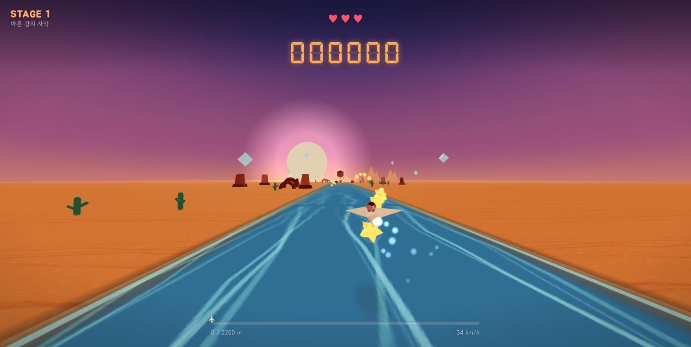
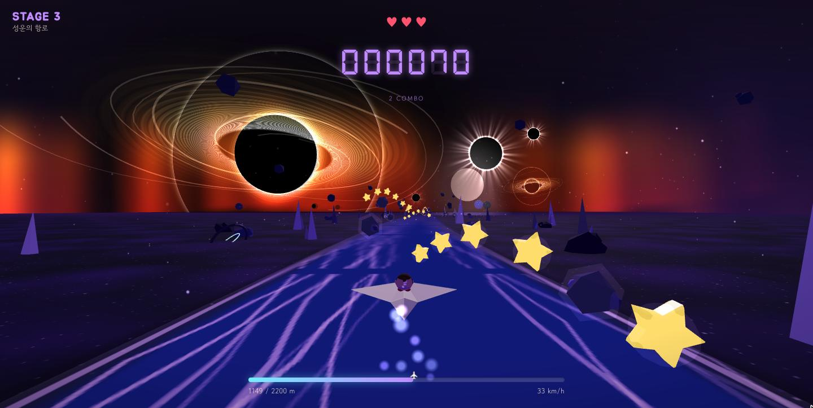
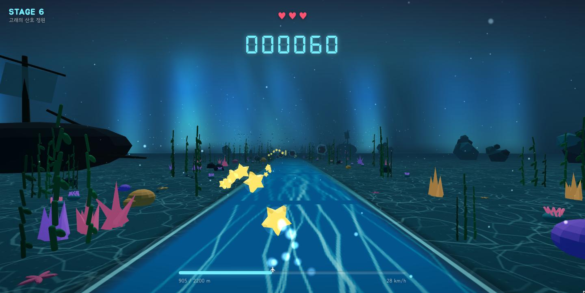
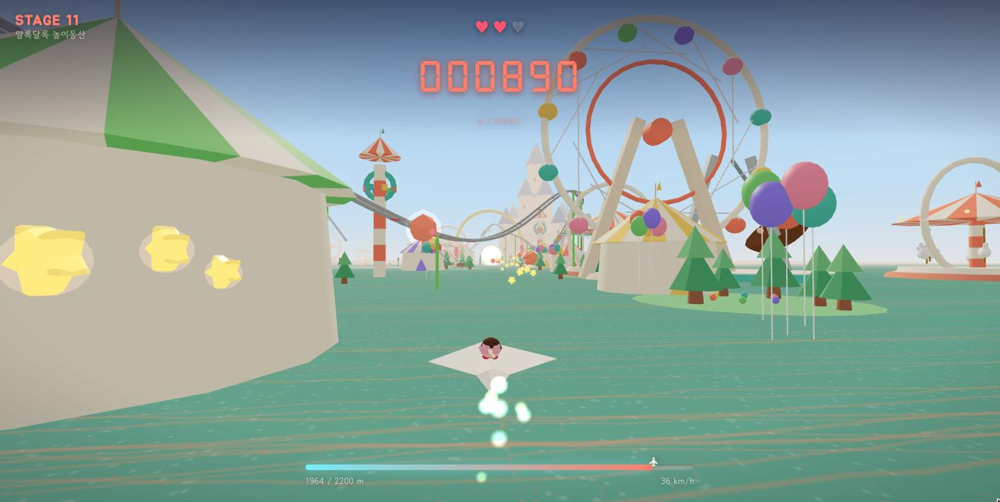

# Paper Flight — 종이비행기 모험


미니미를 태운 종이비행기가 스테이지를 날아 결승 게이트까지 가는 3D 러너.
카메라는 비행기 뒤에 붙어 있고, 비행기와 미니미 모두 뒷모습이 보인다.

## 플레이 화면

| | |
| --- | --- |
| <br>**STAGE 1** — 마른 강의 사막 | <br>**STAGE 3** — 성운의 항로 |
| <br>**STAGE 6** — 고래의 산호 정원 | <br>**STAGE 11** — 알록달록 놀이동산 |

| 스테이지 | 무대 | 목표 거리 |
| --- | --- | --- |
| STAGE 1 | 마른 강의 사막 — 노을, 사구, 메사, 선인장 | 2200 m |
| STAGE 2 | 오로라의 빙원 — 오로라 커튼, 눈, 빙산, 전나무 | 2200 m |
| STAGE 3 | 성운의 항로 — 별, 붉은 오로라, 소행성, 블랙홀, 개기일식 | 2200 m |
| STAGE 4 | 타오르는 불구덩이 — 용암 균열 바닥, 화산, 불기둥, 불티 | 2200 m |
| STAGE 5 | 메아리치는 대협곡 — 4겹 곡면 지층 절벽, 후두, 새 떼 | 2200 m |
| STAGE 6 | 고래의 산호 정원 — 커스틱 바닥, 산호·해초 숲, 물고기 떼 7무리, 난파선, 기포 | 2200 m |
| STAGE 7 | 구름바다 위에서 — 통과하는 뭉게구름, 열기구, 철새 V편대, 무지개 | 2200 m |
| STAGE 8 | 미니미의 집 — 마룻바닥, 거대 크레용·연필·블록·그림책·곰인형, 장난감 기차, 가구 실루엣 | 2200 m |
| STAGE 9 | 수정 동굴 — 종유석 천장, 석순·돌기둥, 빛나는 수정·버섯, 박쥐 떼 | 2200 m |
| STAGE 10 | 마천루 상공 — 한낮 도시를 내려다보는 활공, 유리 타워·공원·강 | 2200 m |
| STAGE 11 | 알록달록 놀이동산 — 코스 전체를 잇는 롤러코스터, 대관람차·회전목마·드롭타워·바이킹·범퍼카 | 2200 m |

코스는 직선이 아니라 좌우로 굽이친다. 길·소품·별·장애물·결승 게이트가 모두
`src/game/track.ts` 의 중심선 함수를 따라 배치되고, 카메라도 그 중심선을 좇는다.
굽이의 폭과 주기는 스테이지마다 다르다(`StageConfig.curve`).

## 실행

```bash
pnpm install
pnpm dev      # http://127.0.0.1:5183
pnpm build    # tsc --noEmit && vite build
```

## 기술 스택

### 런타임 의존성

| 패키지 | 설치 버전 (`package.json` 범위) | 쓰임 |
| --- | --- | --- |
| `react` | 19.2.8 (`^19.0.0`) | UI. 타이틀/HUD/오버레이 |
| `react-dom` | 19.2.8 (`^19.0.0`) | `createRoot` 마운트 (`src/main.tsx`) |
| `three` | 0.180.0 (`^0.180.0`) | 3D 렌더링 코어. 지오메트리·머티리얼·셰이더 |
| `@react-three/fiber` | 9.7.0 (`^9.0.0`) | three.js 를 React 컴포넌트로 다루는 렌더러. `<Canvas>`, `useFrame`, `useThree` |
| `@react-three/drei` | 10.7.8 (`^10.0.0`) | **현재 소스에서 import 하는 곳이 없다.** 제거 대상 |

### 빌드·개발 도구

| 패키지 | 설치 버전 (`package.json` 범위) | 쓰임 |
| --- | --- | --- |
| `vite` | 7.3.6 (`^7.0.0`) | 개발 서버 + 번들러. `127.0.0.1:5183` (`vite.config.ts`) |
| `@vitejs/plugin-react` | 5.2.0 (`^5.0.0`) | React Fast Refresh, JSX 변환 |
| `typescript` | 5.9.3 (`^5.7.0`) | 타입 체크 전용(`noEmit`). 트랜스파일은 Vite 담당 |
| `@types/react`, `@types/react-dom`, `@types/three` | ^19 / ^19 / ^0.180 | 타입 정의 |

패키지 매니저는 **pnpm** (lockfile `pnpm-lock.yaml`, 검증 환경 pnpm 11.20.0 / Node 24.19.0).

### TypeScript 설정 (`tsconfig.json`)

`target: ES2022`, `module: ESNext`, `moduleResolution: bundler`, `jsx: react-jsx`.
`strict` 에 더해 `noUnusedLocals`, `noUnusedParameters`, `noFallthroughCasesInSwitch`,
`isolatedModules`, `verbatimModuleSyntax` 가 모두 켜져 있다.
타입만 import 할 때는 `import type` 을 반드시 써야 한다(`verbatimModuleSyntax`).

### 브라우저 API 직접 사용

프레임워크로 감싸지 않고 브라우저 API 를 그대로 쓰는 영역이다.

| API | 파일 | 쓰임 |
| --- | --- | --- |
| Canvas 2D | `src/game/textures.ts` | 모래·용암·물결·마루 등 모든 텍스처를 런타임에 그린다 |
| Web Audio | `src/game/audio.ts` | 바람·날갯짓·타격음·BGM 을 오실레이터와 노이즈로 합성 |
| GLSL 셰이더 | `Sky.tsx`, `Aurora.tsx`, `Ground.tsx`, `stages/BlackHole.tsx`, `stages/Eclipse.tsx` | 하늘 그라데이션, 오로라 커튼, 바닥, 강착 원반, 코로나 |
| Pointer / Keyboard Events | `src/game/input.ts` | 키보드·드래그·터치 입력을 하나의 축 값으로 정규화 |

### 에셋 정책

**외부 에셋은 웹폰트 하나뿐이다.** `public/fonts/DSEG7Classic-Bold.woff2` (HUD 7세그먼트 숫자).
이미지·3D 모델·오디오 파일은 하나도 없다. 지형과 텍스처는 Canvas 2D 로,
소리는 Web Audio 로, 종이비행기와 미니미는 삼각형 지오메트리를 코드에서 직접 접어 만든다.

### 상태 관리

라이브러리를 쓰지 않는다. `src/game/state.ts` 가 둘로 나뉜다.

- **React state** — HUD 에 보이는 값(점수·하트·거리). 바뀔 때만 리렌더한다.
- **`rt` 객체** — 매 프레임 변이되는 런타임 값(위치·속도·각도). React 밖에 두어
  60fps 리렌더를 피한다. `GameLoop.tsx` 의 `useFrame` 이 직접 쓰고 읽는다.

## 조작

| 키 | 동작 |
| --- | --- |
| ← → / A D | 좌우 |
| ↑ ↓ / W S | 고도 |
| Z | 부스터 |
| X | 감속·정지 |
| Space / Enter | 시작·이어하기 |
| Esc / P | 일시정지 |
| R | 처음부터 |

마우스를 누른 채 움직이거나(드래그) 화면을 터치해도 조종된다. 커서를 올려놓기만 해서는 조종되지 않는다.

타이틀 화면에서 스테이지를 고를 수 있고, 클리어하면 다음 스테이지로 점수를 이어서 넘어간다.
일시정지·클리어·추락 화면의 `타이틀로` 로 언제든 스테이지 선택으로 돌아간다.

## 규칙

- 별을 먹으면 10점. 5개 연속마다 배수가 오른다.
- 바위 기둥·떠 있는 석판·모래 회오리에 부딪히면 하트가 하나 준다. 하트 3개.
- 목표 거리(전 스테이지 2200m)에 도달하면 클리어. 남은 하트당 150점 보너스.
- 굽이에서는 밀려 느려진다. `Z` 부스터를 밟으면 즉각 튀어나가고 엔진에 불꽃이 인다. `X` 는 점점 감속해 멈춘다.
- **모든 스테이지에** 무지개 스트라이프의 **반짝이 스타**가 두 번 나온다(목표의 30% · 68% 지점).
  먹으면 콰광 하는 번개 소리와 함께 `BOOSTER ON!!!` 배너가 뜨고 **3.5초간 무적**이 된다.
  그동안 부스터는 100km/h 까지 오르고, 화염이 커지며 푸르게 타고, 소닉붐·속도선·줌아웃·비네팅이 함께 걸린다.
- 다음 스테이지로 넘어가면 점수는 누적되고 하트는 3개로 회복된다.

## 구조

```
src/
  App.tsx                 상태 전환(타이틀/플레이/일시정지/클리어/오버)과 입력 설치
  styles.css              HUD·오버레이 스타일
  game/
    Scene.tsx             Canvas 구성. biome 별 배경을 여기서 분기한다
    GameLoop.tsx          물리·거리·속도·HUD 갱신 (매 프레임 최상단에서 실행)
    state.ts              HUD 상태(React) + rt(매 프레임 변이되는 런타임 값)
    actions.ts            피격/획득/클리어
    input.ts              키보드·포인터 입력 정규화
    FollowCamera.tsx      3인칭 추적 카메라
    Player.tsx            비행기 + 미니미 + 꼬리 반짝임 + 바닥 그림자
    PaperPlane.tsx        종이비행기 지오메트리(직접 삼각형으로 접는다)
    Minimi.tsx            미니미 캐릭터(뒤통수·묶은 머리·고글 스트랩·목도리)
    Ground.tsx            바닥과 가운데 길. 텍스처 offset 으로 무한 스크롤
    Sky.tsx               하늘 그라데이션 셰이더 + 태양
    Aurora.tsx            오로라·성운 커튼 셰이더 (stage.aurora 가 있을 때만)
    Weather.tsx           흩날리는 입자 (stage.weather: 'snow' | 'ember' | 'dust')
    StarField.tsx         하늘에 박힌 별 (stage.starfield 가 있을 때만)
    track.ts              코스 중심선. 커브 모양은 전부 여기서 나온다
    ScrollField.tsx       소품을 +z 로 흘려보내고 되감는 공통 컴포넌트
    Collectibles.tsx      별
    Obstacles.tsx         장애물 3종
    GoalGate.tsx          결승 게이트
    textures.ts           Canvas 2D 텍스처 생성기
    rng.ts                시드 고정 난수
    stages/
      types.ts            StageConfig 타입
      index.ts            스테이지 데이터
      sceneryUtils.ts     소품 배치 헬퍼 (모든 biome 공용)
      DesertScenery.tsx   사막 소품
      ArcticScenery.tsx   북극 소품
      SpaceScenery.tsx    우주 소품
      LavaScenery.tsx     불구덩이 소품 (불기둥 연출 포함)
      CanyonScenery.tsx   협곡 소품 (곡면 지층 절벽 4겹·후두·새 떼)
      OceanScenery.tsx    바닷속 소품 (산호·해초 숲·물고기 떼·난파선·빛기둥)
      SkyScenery.tsx      하늘 소품 (뭉게구름·열기구·철새 편대·무지개)
      RoomScenery.tsx     어린이 방 소품 (거대 문구·장난감·곰인형·기차·가구)
      CaveScenery.tsx     동굴 소품 (종유석·석순·수정·버섯·박쥐 떼)
      CityScenery.tsx     도시 소품 (유리 타워·구름·경고등, 발밑 시가지)
      ParkScenery.tsx     놀이동산 소품 (연속 롤러코스터·관람차·회전목마·드롭타워·서커스 텐트)
      BlackHole.tsx       블랙홀 (검은 구 + 셰이더로 그린 강착 원반·렌즈 고리)
      Eclipse.tsx         개기일식 (검은 원 + 코로나 셰이더, 흑백)
```

## 스테이지 추가하는 법

1. `src/game/stages/index.ts` 에 `StageConfig` 를 하나 더 만든다.
   하늘·안개·바닥·팔레트 색과 `goal`, `seed` 만 값으로 채우면 된다.
   `aurora` 를 넣으면 하늘에 커튼이 걸리고, `weather` 를 넣으면 입자가 흩날리며,
   `starfield` 는 별을, `groundTexture` 는 바닥 무늬('nebula' 성운, 'lava' 용암 균열, 'caustics' 물결 빛, 'wood' 마루)를, `curve` 는 코스의 굽이를 정한다.
2. 소품이 필요하면 `stages/ArcticScenery.tsx` 처럼 파일을 만들고
   `Scene.tsx` 의 `Scenery` switch 에 `case` 를 추가한다.
   배치는 `sceneryUtils.ts` 의 `makeItems` / `makeFloatingItems` 를 그대로 쓰면 된다.
3. 게임 규칙(속도·조작·충돌·별·장애물)은 스테이지와 무관하게 그대로 동작한다.
   장애물과 게이트는 `stage.palette` 색을 따라가므로 따로 손댈 필요가 없다.
